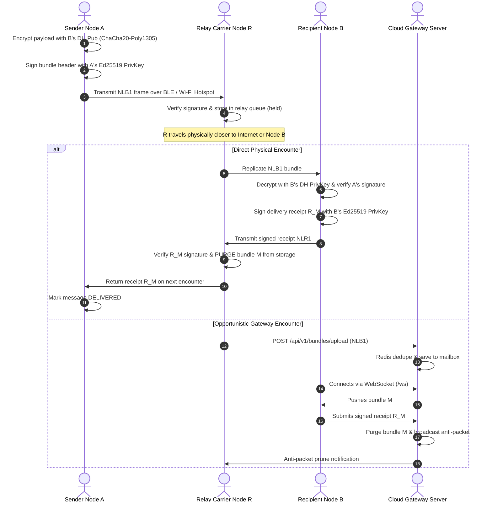

# Low-Level Design (LLD)

This document provides the binary wire formats, database schemas, cryptographic sequence flows, and internal component interfaces for the NearLink ecosystem.

---

## 1. Binary Wire Formats

NearLink does not use JSON or XML on physical radio links. All frames are binary-encoded for bandwidth efficiency and zero-copy parsing.

### 1.1 Contact Card Format (`NL1:...`)
Exchanged out-of-band via optical QR codes or Bluetooth Low Energy advertising:

```
+---------------------------------------------------------------+
| Prefix: "NL1:"                                                |
| Base64URL-encoded payload:                                    |
|   nameLen (2 bytes, big-endian unsigned)                      |
|   name (UTF-8 string, nameLen bytes)                          |
|   signPub (32 bytes, Ed25519 public key)                      |
|   dhPub   (32 bytes, X25519 public key)                       |
+---------------------------------------------------------------+
```

```text
id = SHA-256("NL-id" || signPub || dhPub)
```

### 1.2 Bundle Wire Format (`NLB1`)
Carries an encrypted message through multi-hop transit:

```
+---------------------+-------------------+---------------------+
| Field               | Size (bytes)      | Description         |
+---------------------+-------------------+---------------------+
| Magic Bytes         | 4                 | 'NLB1'              |
| Bundle ID           | 32                | Unique hash (SHA256)|
| Recipient ID        | 32                | Node ID of receiver |
| Sender ID           | 32                | Node ID of creator  |
| Expiry Timestamp    | 8 (uint64)        | Milliseconds epoch  |
| Hop Count           | 1 (uint8)         | Replications count  |
| Max Hops            | 1 (uint8)         | TTL hop limit (<=5) |
| Payload Length      | 4 (uint32)        | Size of ciphertext  |
| Sealed Payload      | payloadLen        | AEAD ciphertext     |
| Ephemeral DH Pub    | 32                | Sender's X25519 pub |
| Nonce               | 12                | ChaCha20 nonce      |
| Sender Signature    | 64                | Ed25519 signature   |
+---------------------+-------------------+---------------------+
```

### 1.3 Anti-Packet Delivery Receipt Format (`NLR1`)
Cancels outstanding copies in transit and confirms honest delivery:

```
+---------------------+-------------------+---------------------+
| Field               | Size (bytes)      | Description         |
+---------------------+-------------------+---------------------+
| Magic Bytes         | 4                 | 'NLR1'              |
| Bundle ID           | 32                | Original bundle ID  |
| Recipient ID        | 32                | Recipient node ID   |
| Timestamp           | 8 (uint64)        | Delivered time (ms) |
| Recipient Signature | 64                | Ed25519 signature   |
+---------------------+-------------------+---------------------+
```

---

## 2. Database Schema (PostgreSQL 16 & Drizzle ORM)

```typescript
// apps/backend/src/infra/db/schema.ts

export const identities = pgTable('identities', {
  idHex: varchar('id_hex', { length: 64 }).primaryKey(),
  name: text('name').notNull(),
  signPubHex: varchar('sign_pub_hex', { length: 64 }).notNull(),
  dhPubHex: varchar('dh_pub_hex', { length: 64 }).notNull(),
  cardString: text('card_string').notNull(),
  registeredAt: timestamp('registered_at').defaultNow().notNull(),
  lastSeenAt: timestamp('last_seen_at').defaultNow().notNull(),
});

export const bundles = pgTable('bundles', {
  idHex: varchar('id_hex', { length: 64 }).primaryKey(),
  toIdHex: varchar('to_id_hex', { length: 64 }).references(() => identities.idHex),
  fromIdHex: varchar('from_id_hex', { length: 64 }).references(() => identities.idHex),
  expiryMs: bigint('expiry_ms', { mode: 'number' }).notNull(),
  hopCount: integer('hop_count').default(0).notNull(),
  rawWireBase64: text('raw_wire_base64').notNull(),
  status: varchar('status', { length: 32 }).default('QUEUED').notNull(),
  createdAt: timestamp('created_at').defaultNow().notNull(),
});

export const receipts = pgTable('receipts', {
  bundleIdHex: varchar('bundle_id_hex', { length: 64 }).primaryKey(),
  recipientIdHex: varchar('recipient_id_hex', { length: 64 }).notNull(),
  deliveredAtMs: bigint('delivered_at_ms', { mode: 'number' }).notNull(),
  signatureHex: varchar('signature_hex', { length: 128 }).notNull(),
  createdAt: timestamp('created_at').defaultNow().notNull(),
});
```

---

## 3. Sequence Flow: Direct & Multi-Hop Relay


