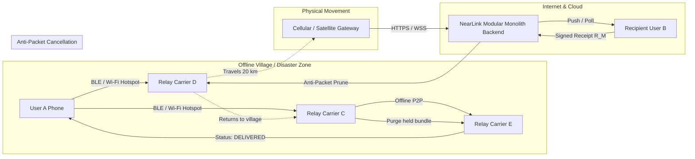

# NearLink Documentation

**NearLink** is a decentralized, offline smartphone-to-smartphone messaging platform and store-carry-forward delay-tolerant network (DTN) engineered for ordinary consumer devices.

---

## 1. Problem Statement

Modern communication infrastructure is fundamentally centralized, dependent on continuous access to cellular towers, undersea cables, and cloud data centers. In the real world, this infrastructure frequently collapses:

1. **Disaster Zones:** Earthquakes, tsunamis, floods, and hurricanes sever fiber backhauls and topple cell towers within minutes, stranding survivors with functional smartphones that cannot transmit SOS messages.
2. **Rural & Remote Villages:** Over 2.6 billion people globally live in regions with intermittent, expensive, or nonexistent cellular reception.
3. **Crowded Transit Terminals:** At international airports, music festivals, and stadium events, local cellular cell towers experience extreme channel congestion, rendering standard messaging apps inoperable.
4. **Network Censorship & Outages:** Targeted cellular shutdowns disconnect entire populations from emergency communication.

### Why Existing Solutions Fall Short
* **Bluetooth Mesh (SIG):** Requires pre-provisioned network credentials and lacks store-and-forward persistence across mobile nodes moving through physical space.
* **Apple AirDrop / Quick Share:** Built for synchronous, single-hop file transfers between actively unlocked devices; cannot propagate multi-hop messages asynchronously.
* **FireChat / Bridgefy (Legacy):** Relied on unencrypted or weakly encrypted proprietary protocols, susceptible to packet forgery, man-in-the-middle attacks, and memory exhaustion under relay flood attacks.

---

## 2. The NearLink Solution

NearLink turns every passing smartphone into an opportunistic, zero-configuration relay packet carrier:

### Core Design Tenets
1. **Zero Infrastructure Requirement:** Functions 100% offline using standard Bluetooth Low Energy (BLE) and Wi-Fi radios present in every Android and iOS smartphone.
2. **Zero-Trust Cryptographic Security:** All messages are end-to-end encrypted with X25519 Ephemeral Diffie-Hellman and ChaCha20-Poly1305. Intermediate relay nodes **cannot decrypt** content, tamper with headers, or impersonate senders.
3. **Honest Delivery Statuses:** Relays are never reported as "delivered" to avoid dangerous false security. Senders see `QUEUED` $\rightarrow$ `FORWARDED (Hops: N)` $\rightarrow$ `DELIVERED`, flipping to delivered **only** upon verifying a cryptographic Ed25519 signature from the recipient.
4. **Anti-Packet Reconcilation:** When a message is delivered to the recipient (via any path or gateway), an anti-packet delivery receipt $R_M$ cascades through the mesh, atomically purging duplicate copies from carrier queues.
5. **Microsecond Time-Bucketed Merkle Sync:** Synchronizes 10,000+ cancellation and receipt records between passing phones in **under 2.5 milliseconds**, reducing synchronization bandwidth by **99%** compared to linear scanning.
