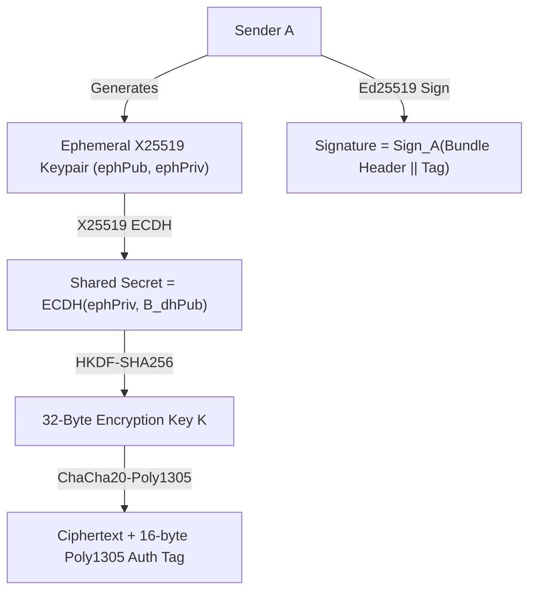

# Cryptographic Specifications

NearLink's security architecture provides end-to-end confidentiality, sender authentication, integrity, forward secrecy, and non-repudiation across hostile multi-hop relays.

---

## 1. Cryptographic Primitive Selection

| Purpose | Algorithm | Standard / RFC | Key Size |
|---|---|---|---|
| Identity & Receipts | **Ed25519** | RFC 8032 | 32-byte public, 64-byte private |
| Key Exchange | **X25519 (ECDH)** | RFC 7748 | 32-byte public, 32-byte private |
| Key Derivation | **HKDF-SHA256** | RFC 5869 | Extract-and-Expand to 32 bytes |
| AEAD Encryption | **ChaCha20-Poly1305** | RFC 8439 | 256-bit key, 96-bit random nonce |
| Hash & Fingerprints | **SHA-256** | FIPS 180-4 | 32 bytes (256 bits) |

---

## 2. Key Derivation & Message Sealing

When Sender $A$ transmits message $m$ to Recipient $B$:



1. **Ephemeral Key Generation:**
   Sender generates single-use ephemeral keypair `(e_priv, e_pub)`.

2. **Shared Secret Agreement:**
   ```text
   S = X25519(e_priv, B_dhPub)
   ```

3. **HKDF Derivation:**
   ```text
   K = HKDF-Expand(HKDF-Extract("NL-salt", S), "NL-payload-key", 32)
   ```

4. **Authenticated Encryption:**
   ```text
   C, T = ChaCha20-Poly1305-Encrypt(K, nonce, plaintext, AAD)
   ```
   where `AAD = bundleId || A_id || B_id || expiry`.

5. **Sender Authentication:**
   ```text
   sigma_A = Sign(A_signPriv, bundleHeader || T)
   ```

---

## 3. Symmetrical Out-of-Band Safety Codes

To defend against active Man-in-the-Middle (MITM) attacks during initial contact exchange, NearLink calculates a 20-digit symmetrical safety code identical on both users' phones:

1. Canonical ordering of 32-byte node IDs:
   ```text
   first = min(A_id, B_id)
   second = max(A_id, B_id)
   ```
2. Hash computation:
   ```text
   H = SHA-256("NL-safety" || first || second)
   ```
3. Formatted into 4 groups of 5 characters:
   ```text
   9c90a 3d32d b2c24 ad5a9
   ```
Users can compare this code out loud or visually when scanning contact QR codes.
