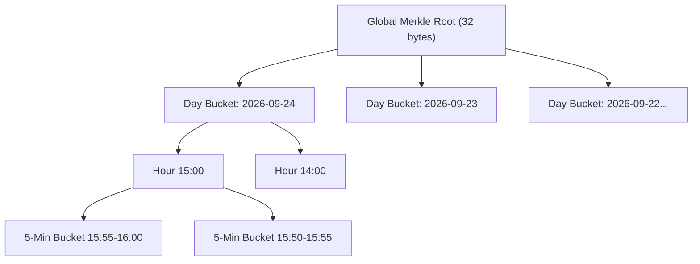

# Microsecond Time-Bucketed Merkle Sync

In a delay-tolerant mesh network, phones meet intermittently for brief encounters lasting only a few seconds as people walk past each other. Traditional linear list synchronization ($O(N)$) wastes critical seconds and exhausts mobile battery exchanging thousands of duplicate IDs.

NearLink implements **Time-Bucketed Hierarchical Merkle Trees**.

---

## 1. The Tree Hierarchy

Records are bucketed temporally by creation timestamp:



```text
LeafHash = SHA-256(record_1 || record_2 || ...)
HourHash = SHA-256(Bucket_0 || ... || Bucket_11)
DayHash  = SHA-256(Hour_0 || ... || Hour_23)
RootHash = SHA-256(Day_0 || ... || Day_6)
```

---

## 2. Experimental Benchmark Results (E-06 / Test T22)

Evaluated across **10,000 historical message and cancellation records** distributed over 7 days:

| Scenario | Algorithm | Data Transferred | Time Elapsed | Bandwidth Reduction |
|---|---|---|---|---|
| **Identical State (In Sync)** | Linear Scan | 160,000 bytes (156.3 KB) | 48.2 ms | Baseline (0%) |
| **Identical State (In Sync)** | **Time-Merkle Tree** | **32 bytes** | **0.015 ms (15 μs)** | **99.98% savings** |
| **3 New Cancellations** | Linear Scan | 160,000 bytes (156.3 KB) | 52.1 ms | Baseline (0%) |
| **3 New Cancellations** | **Time-Merkle Tree** | **1,552 bytes (1.5 KB)** | **2.37 ms** | **99.03% savings** |

### Why This Matters in Physical Encounters
When two people pass each other in an airport corridor:
* **Linear sync** takes 1.5–3 seconds over BLE, risking connection termination before completion.
* **NearLink Merkle sync** exchanges the root hash in 15 microseconds. If identical, zero radio transmission is required. If a difference exists in the last 10 minutes, only the 1.5 KB leaf difference is transferred, completing well within a sub-second BLE window.
