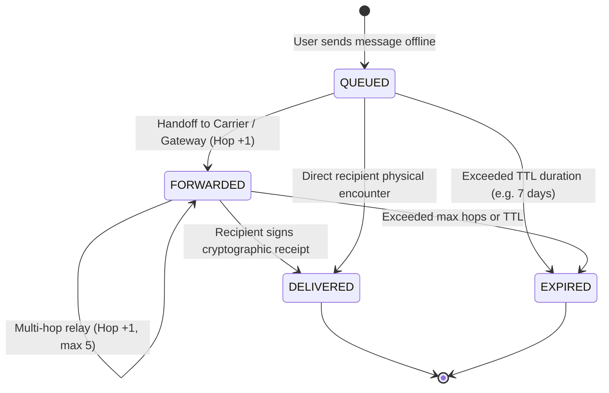

# Honest Delivery Status Badges

In life-critical emergency and disaster scenarios, a false delivery confirmation can cost human lives. Many conventional peer-to-peer messaging applications show "Sent" or "Delivered" the moment a message leaves the phone or touches any nearby device, even if that device never reaches the recipient.

**NearLink strictly enforces Honest Delivery Statuses.**

---

## 1. The Four-State Lifecycle State Machine

### 1. `⏳ QUEUED` (Amber)
* **Definition:** The encrypted message has been signed and sealed on the local device, but has not yet been accepted by any peer or network gateway.
* **Guarantee:** The sender knows with 100% certainty that no other device has received the bundle yet.

### 2. `✉ FORWARDED (Hops: N)` (Cyan)
* **Definition:** The bundle has been replicated to $N$ intermediate carrier devices or ingested into the Cloud Gateway.
* **Guarantee:** The sender knows their message is moving through physical space, but is explicitly informed that **the recipient has not yet confirmed receipt**.

### 3. `✔ DELIVERED (Receipt verified)` (Emerald Green)
* **Definition:** An anti-packet receipt $R_M$ containing the recipient's Ed25519 digital signature has arrived and been cryptographically validated against the recipient's public key.
* **Guarantee:** Mathematical proof of non-repudiation. The recipient's hardware definitely decrypted the message.

### 4. `✖ EXPIRED` (Ruby Red)
* **Definition:** The bundle exceeded its maximum time-to-live or hop limit without receiving a verified receipt.
